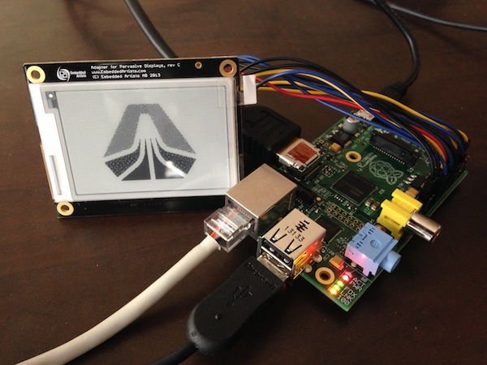
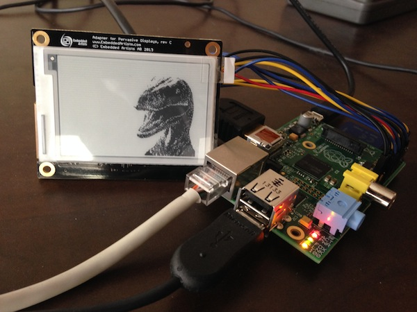

# pi-epaper

## Overview

If you have ever tried to display something on an e-paper screen from your Raspberry Pi, you understand what a painful process it can be. If you succeeded, you're probably a rockstar programmer. I am not a rockstar programmer, but I got it to work with a mishmash of bits and pieces of code and a lot of research about how the e-paper display works.

Here's how to do it so I can save you possibly weeks of work. Why? Because I'm a nice guy.

This software will allow you to easily take appropriately sized images on your machine (or from anywhere, really) and display them correctly on the e-paper display. This is no simple task since the demo software that you get with the e-paper display only has two demo images that are built in code, which doesn't work in real-world scenarios.



## Hardware

You'll need a bit of hardware to get started.

1. A Raspberry Pi. You can purchase these [literally everywhere](https://www.google.com/search?q=raspberry+pi&tbm=shop). Doesn't matter what model, but we use the Model B.
2. An [Embedded Artists e-paper display](http://www.embeddedartists.com/products/displays/lcd_27_epaper.php). Specifically, this code is made to work with the 2.7" model.

## Software

### Linux Version

I'm using the latest version of [Rasbian](http://www.raspbian.org/), installed using the [NOOBS](http://www.raspberrypi.org/downloads) bootloader.

### Software Dependencies

You'll need a few things to get started:

1. The Linux build tools
2. [ImageMagick](http://www.imagemagick.org/)
3. libi2c developer tools (if you're not running Rasbian)
4. Git (this may already be installed)

Here's a simple one-liner for you to run:

```bash
sudo apt-get update && sudo apt-get install -y gcc make build-essential imagemagick git-core libi2c-dev
```

This will likely take a while. Go grab a cup of :coffee: or a :beer:.

Next, install [wiringPi](http://wiringpi.com/download-and-install/). Here's a quick cheet sheet:

```bash
git clone git://git.drogon.net/wiringPi
cd wiringPi
./build
```

You can delete the `wiringPi` directory once it has installed.

## Putting The Hardware Together

You'll want to [follow the wiring diagram](http://www.embeddedartists.com/sites/default/files/support/displays/epaper/Epaper_RaspberryPi.pdf) from Embedded Artists on how to wire the e-paper display up to the [GPIO pins](http://en.wikipedia.org/wiki/General-purpose_input/output) on your Raspberry PI.

## Compiling the Software

1. Clone the repository to your Raspberry Pi and cd into the directory.
2. Run `make`.
3. This will create the compiled binary named `epaper`.
4. There is no step 4.

## Running the Software

In order for the software to talk to the GPIO pins, you have to turn them on. This only needs to be run once per boot:

```bash
gpio load spi && gpio load i2c
```

Simply pass an image file that is `264x176` or smaller (the application will automatically pad the image to that size) to the binary like so:

```bash
sudo ./epaper ~/my_awesome_image.png
```

A few things to note here:

1. It doesn't matter what format your image is in. JPG, GIF, TIFF, whatever. ImageMagick will take care of that automatically for us.
2. Don't forget to `sudo` when you run the binary. The application requires `sudo` access in order to use the GPIO pins.

## Testing

This image is a full `264x176` png image.

```bash
sudo ./epaper ./test_images/velociraptor.png
```



This image is smaller than `264x176` so the application should pad the image to the middle of the display.

```bash
sudo ./epaper ./test_images/skookum.png
```


# Contributing

See the [Contributing.md](Contributing.md) file for more information.

# License

The portions written by Skookum Digital Works are MIT licensed

```
Copyright 2013 Skookum Digital Works

Permission is hereby granted, free of charge, to any person obtaining a copy
of this software and associated documentation files (the "Software"), to deal
in the Software without restriction, including without limitation the rights
to use, copy, modify, merge, publish, distribute, sublicense, and/or sell
copies of the Software, and to permit persons to whom the Software is
furnished to do so, subject to the following conditions:

The above copyright notice and this permission notice shall be included in
all copies or substantial portions of the Software.

THE SOFTWARE IS PROVIDED "AS IS", WITHOUT WARRANTY OF ANY KIND, EXPRESS OR
IMPLIED, INCLUDING BUT NOT LIMITED TO THE WARRANTIES OF MERCHANTABILITY,
FITNESS FOR A PARTICULAR PURPOSE AND NONINFRINGEMENT. IN NO EVENT SHALL THE
AUTHORS OR COPYRIGHT HOLDERS BE LIABLE FOR ANY CLAIM, DAMAGES OR OTHER
LIABILITY, WHETHER IN AN ACTION OF CONTRACT, TORT OR OTHERWISE, ARISING FROM,
OUT OF OR IN CONNECTION WITH THE SOFTWARE OR THE USE OR OTHER DEALINGS IN
THE SOFTWARE.
```

Other parts (not written by us) are outlined in their respective files. Please read all licenses before using this project.

```
Copyright(C) 2012, Embedded Artists AB
All rights reserved.
```

```
Copyright 2013 Pervasive Displays, Inc.
```
